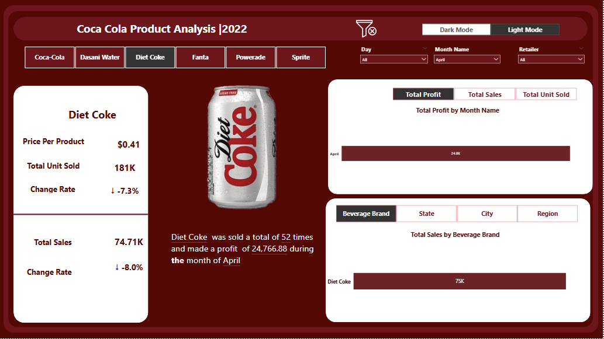
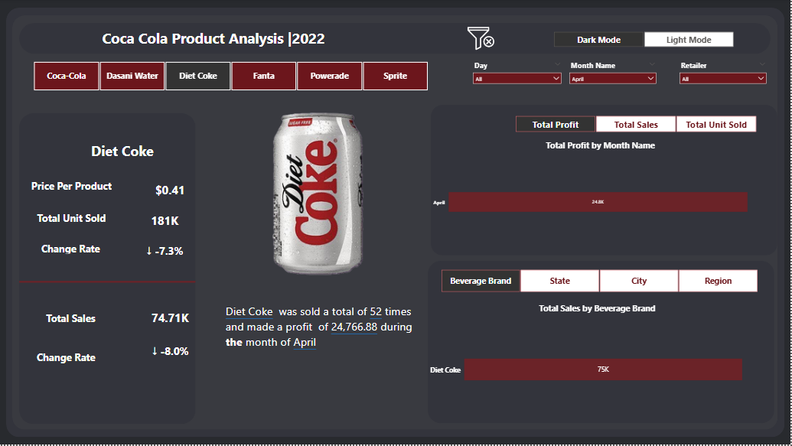

# 🥤 Coca-Cola Product Analysis | 2022
## 📌 Project Overview
This project analyzes **Coca-Cola** product performance in 2022 using Power BI.
The dashboard provides insights into sales, profit, unit sales, and growth trends across multiple beverage brands **(Coca-Cola, Diet Coke, Fanta, Sprite, Powerade, and Dasani Water).**  

The analysis helps stakeholders understand brand-level performance, identify declining products, and support data-driven decision-making for marketing and sales strategies.

## 📊 Dashboard Features  
 **Brand Analysis**: Compare sales & profit across Coca-Cola beverage brands.  
- **Monthly Trends**: Visualize unit sales, profit, and total sales by month.  
- **Product KPIs**: Track Price per Unit, Total Units Sold, Total Sales, and Change Rate.  
- **Filters & Interactivity**: Drill down by Day, Month, Retailer, Brand, State, City, and Region. 
- **Dark Mode / Light Mode** toggle for flexible visualization.

##  🔹 Business Value

This analysis enables Coca-Cola to:

Track brand performance across multiple beverages (Coca-Cola, Diet Coke, Fanta, Sprite, Powerade, etc.).

Monitor profitability trends by month, product, and retailer.
Support decision-making for pricing, promotions, and marketing strategies.

- ## 🧹  Data Cleaning 
 load data in Power BI:

Click Transform Data → it opens Power Query Editor.

Common Cleaning Steps:

Rename Columns → make them clear and consistent.

Change Data Types → set columns to correct types (Date, Decimal, Whole Number, Text).

Remove Unnecessary Columns → right-click column → Remove.

Remove Blank or Error Rows:

Home → Remove Rows → Remove Blank Rows / Remove Errors.

Handle Missing Values (Nulls):

Replace with a fixed value → Transform → Replace Values.

Or remove rows with nulls.

Format Text Columns:

Transform → Format → Trim, Clean, UPPER/lower case.

## 🔹  Insights  
## Coca Cola (normal) :  
  - Price per product: **$0.47**  
  - Units Sold: **4M**  
  - Total Sales: **$1.92M**
  - 
   **Monthly Trends:**
  - The highest monthly profits for Coca-Cola normal were achieved in July and december **$89k**
  -  The highest monthly sales for Coca-Cola normal were achieved in July and december **$223k**
  -  The highest monthly units sold for Coca-Cola normal were achieved in July **$32500**
     
   **Locations Trends**
  - The state that consumes the most Coca-Cola normal is . **New York** **$131k**
  - City that consumes the most Coca-Cola normal is . **New York** **$84k**
  - region that consumes the most Coca-Cola normal is . **Northeast** **$498,157**

    ## Dasani Water :  
  - Price per product: **$0.55**  
  - Units Sold: **3M**  
  - Total Sales: **$1.64M**
  - 
   **Monthly Trends:**
  - The highest monthly profits for Dasani Water were achieved in July  **$78k** then June **$75k**
  -  The highest monthly sales for Dasani Water were achieved in July  **$200k** then June **$199k**
  -  The highest monthly units sold for Dasani Water were achieved in July  **301k** then June **$299k**
     
   **Locations Trends**
  - The state that consumes the most Dasani Water is **California** **$112k** then **New York** **$112k**
  - City that consumes the most Dasani Water is . **New York** **$74k**
  - region that consumes the most Dasani Water is . **West** **$450,787**

    ## Diet Coke  :  
  - Price per product: **$0.46**  
  - Units Sold: **3M**  
  - Total Sales: **$1.39M**
  - 
   **Monthly Trends:**
  - The highest monthly profits for Diet Coke were achieved in August and december **$58k**
  -  The highest monthly sales for Diet Coke were achieved in december  **$168k** then August  **$167k**
  -  The highest monthly units sold for Diet Coke were achieved in december and August **$291k** 
     
   **Locations Trends**
  - The state that consumes the most Diet Coke is .  **California** **$107k** then **New York** **$92k**
  - City that consumes the most Diet Coke is  **New York** **$62k** .**San Francisco** **$60k** 
  - region that consumes the most Diet Coke is . **West** **$450,812**

    ## Fanta :  
  - Price per product: **$0.43**  
  - Units Sold: **2M**  
  - Total Sales: **$969,89K**
  - 
   **Monthly Trends:**
  - The highest monthly profits forFanta were achieved in **december** **$47k** then **July** **$41k**
  -  The highest monthly sales for Fanta were achieved in **december** **$127k** then **July** **$110k**
  -  The highest monthly units sold for Fanta were achieved in **december** **223k** then **July** **213k**
     
   **Locations Trends**
  - The state that consumes the most Fanta is .**California** **$81k** then **New York** **$74k**
  - City that consumes the most Fanta is . **New York** **$52k** .**San Francisco** **$46k** 
  - region that consumes the most Fanta is . **West** **$313,287K**

    ## Powerade :  
  - Price per product: **$0.54**  
  - Units Sold: **2M**  
  - Total Sales: **$1.13**
  - 
   **Monthly Trends:**
  - The highest monthly profits for Poweradewere achieved in **July** **$k51**  and **december** **$50k**
  -  The highest monthly sales for Powerade were achieved in **december**  **$k137**  and **July** **$136k**
  -  The highest monthly units sold for Powerade were achieved in **July** **k226**  and **december** **211k**
     
   **Locations Trends**
  - The state that consumes the most Powerade is . **New York** **$95k** then **Florida** **$91k** 
  - City that consumes the most Powerade is . **New York** **$65k**
  - region that consumes the most Powerade is . **Northeast** **$309,800**

    ## Sprite :  
  - Price per product: **$0.42**  
  - Units Sold: **3M**  
  - Total Sales: **$1.16M**
  - 
   **Monthly Trends:**
  - The highest monthly profits for Sprite were achieved in   **december** and **July** **$50k**
  -  The highest monthly sales for Sprite were achieved in **december** **$141k** then **July** **$139k**
  -  The highest monthly units sold for Sprite were achieved in **July** **$263k** then **August** **$259k**
     
   **Locations Trends**
  - The state that consumes the most Sprite is . **California** **$94k**
  - City that consumes the most Sprite is . **New York** and **Sanfrancisco** **$50k** 
  - region that consumes the most Sprite is . **West** **$384,687**

    ## 📸 Dashboard Preview
## Light mode

## Dark mode

## 🔹 Strategic Recommendations

Focus high-selling regions and retailers to maximize sales opportunities.

Investigate consumer behavior shifts that may explain the sales decline.

Continuously monitor monthly sales and profit KPIs to ensure timely adjustments.

    
